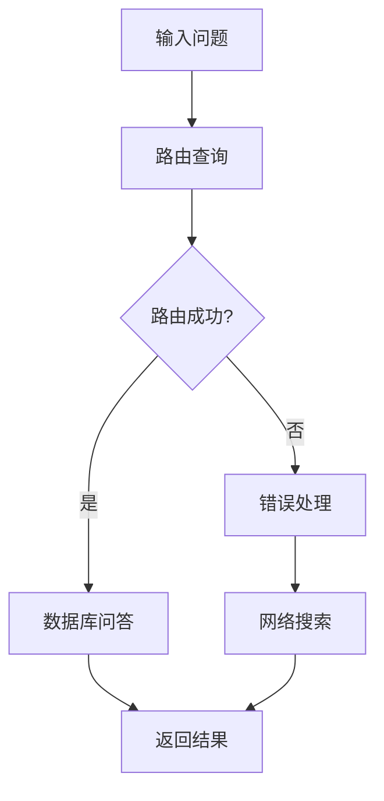

# RAG数据库路由系统

一个基于LangGraph和现代架构的智能文档检索系统，支持多数据库路由和智能问答。

## 🌟 特性

- **智能路由**: 结合向量相似性和LLM分析的混合路由策略
- **多数据库支持**: 支持产品、支持、财务三个独立的知识库
- **多模态Embedding**: 支持豆包多模态embedding（文本+图片+视频）
- **自动回退机制**: 豆包 → OpenAI → 模拟embedding的智能回退
- **现代架构**: 使用LangGraph工作流和模块化设计
- **容错机制**: 包含网络搜索备用方案
- **环境配置**: 通过.env文件安全管理API密钥
- **类型安全**: 完整的类型提示支持

## 🏗️ 架构

```
src/
├── models/          # 模型配置和管理
│   ├── config.py    # 环境变量配置
│   └── llm_config.py # LLM和embedding配置
├── prompts/         # Prompt模板管理
│   └── routing_prompts.py
├── tools/           # 工具和实用程序
│   ├── vector_store.py     # Qdrant向量存储管理
│   ├── document_processor.py # 文档处理
│   └── web_search.py       # 网络搜索工具
├── agents/          # 智能代理
│   ├── routing_agent.py    # 路由代理
│   └── qa_agent.py         # 问答代理
├── data/            # 数据配置
│   └── collection_config.py # 数据库集合配置
├── workflow.py      # LangGraph工作流
└── app.py          # Streamlit应用
```

## 🚀 快速开始

### 1. 环境设置

```bash
# 克隆代码
cd rag_database_routing

# 使用uv 初始化虚拟环境
# 删除现有虚拟环境
rm -rf .venv

# 重新创建虚拟环境
uv venv
vscode or cursor将rag_database_routing添加到 workspace


# 安装依赖
uv sync

# 配置环境变量
cp .env.example .env
# 编辑.env文件，填入您的API密钥
```

### 2. 环境变量配置

在`.env`文件中配置以下变量：

```env
# 豆包配置（优先使用）
ARK_API_KEY=your_ark_api_key_here
ARK_BASE_URL=ark.cn-beijing.volces.com/api/v3
DOUBAO_EMBEDDING_MODEL=doubao-embedding-vision-250615

# OpenAI配置（备用）
OPENAI_API_KEY=your_openai_api_key_here
OPENAI_MODEL=gpt-4o
EMBEDDING_MODEL=text-embedding-3-small

# Qdrant配置  
QDRANT_URL=https://your-cluster.qdrant.tech
QDRANT_API_KEY=your_qdrant_api_key_here
```

### 3. 运行应用

```bash
# 使用uv运行
uv run streamlit run main.py

# 或者激活虚拟环境后运行
source .venv/bin/activate  # Linux/Mac
# 或 .venv\Scripts\activate  # Windows
streamlit run main.py
```

## 💡 系统工作原理

### 1. 文档处理流程

1. **文档上传**: 支持PDF、TXT、Markdown文件
2. **文本分割**: 使用RecursiveCharacterTextSplitter分割文档
3. **向量化**: 优先使用豆包多模态embedding（2048维），自动回退到OpenAI
4. **存储**: 分类存储到Qdrant的不同集合中

### 2. 智能路由机制

系统使用**双重路由策略**：

#### 主要方法：向量相似性路由
- 在所有数据库中搜索与问题最相似的文档
- 计算平均相似性分数
- 如果置信度≥0.5，直接使用向量路由结果

#### 备用方法：LLM路由
- 当向量路由置信度低时启用
- 使用专门的路由Agent分析问题内容
- 基于语义理解做出路由决策

#### 终极备用：网络搜索
- 当数据库中没有相关内容时
- 使用DuckDuckGo进行网络搜索

### 3. LangGraph工作流



## 🗂️ 数据库分类

系统支持三种预定义的数据库类型：

- **products**: 产品信息（产品详情、规格、功能）
- **support**: 客户支持（FAQ、指南、故障排除）
- **finance**: 财务信息（财务数据、收入、成本）

## 🔧 高级配置

### 自定义设置

在`src/models/config.py`中可以调整：

- `similarity_threshold`: 向量相似性阈值（默认: 0.5）
- `chunk_size`: 文档分块大小（默认: 1000）
- `chunk_overlap`: 分块重叠大小（默认: 200）
- `vector_size`: 向量维度（默认: 1536）

### 添加新的数据库类型

1. 在`src/data/collection_config.py`中添加新的配置
2. 更新`DatabaseType`类型定义
3. 在Streamlit应用中添加相应的UI

## 🐛 故障排除

### 常见问题

1. **连接失败**: 检查API密钥和网络连接
2. **内存不足**: 调整chunk_size和batch大小
3. **查询速度慢**: 检查Qdrant集群性能

### 调试模式

设置环境变量：
```env
DEBUG=true
LOG_LEVEL=DEBUG
```

## 📈 性能优化

- 使用缓存的LLM和embedding实例
- 批量处理文档上传
- 向量搜索结果缓存
- 异步处理支持

## 🥄 豆包多模态Embedding

### 特性
- **多模态支持**: 文本、图片、视频的统一向量化
- **高质量中文**: 专为中文优化的embedding模型
- **2048维向量**: 提供更丰富的语义表示
- **自动回退**: 豆包 → OpenAI → 模拟的智能回退机制

### 配置示例
```env
ARK_API_KEY=your_ark_api_key
ARK_BASE_URL=ark.cn-beijing.volces.com/api/v3
DOUBAO_EMBEDDING_MODEL=doubao-embedding-vision-250615
```

### 多模态使用
```python
# 文本+图片组合embedding
vector = embeddings.embed_multimodal(
    text="产品图片描述",
    image_url="https://example.com/product.jpg"
)
```

详细信息请参考 [DOUBAO_INTEGRATION.md](./DOUBAO_INTEGRATION.md)

## 🤝 贡献

欢迎提交Issues和Pull Requests！

## 📄 许可证

MIT License

## 🙋‍♂️ 支持

如果您遇到问题，请：

1. 检查环境变量配置
2. 查看应用内的错误信息
3. 提交Issue并附上错误日志